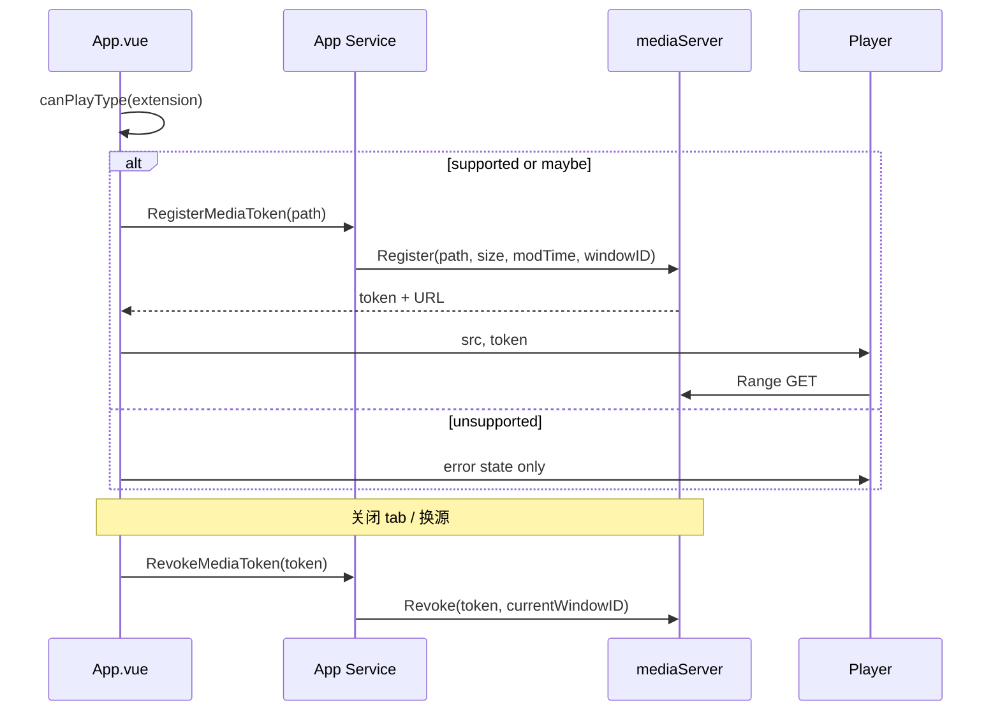

# 音视频预览增强开发设计文档

| 项目 | 内容 |
| --- | --- |
| 功能名称 | 音视频预览可靠性与播放器能力增强 |
| 状态 | 已实现 |
| 修订 | 移除媒体信息菜单；字幕升级为多源多选下拉（同名外挂 + 内嵌轨道 + 手动选择文件）；定位步长调整为 10/30 秒 |
| 涉及模块 | Go 媒体服务、Wails 绑定、Vue 音频/视频预览组件、标签页与会话 |
| 不引入依赖 | FFmpeg、ffprobe、第三方转码服务、第三方播放器库 |

## 1. 背景

当前实现已经将媒体文件从 Wails RPC 读取链路中分离：`ReadFile` 仅返回元数据，前端调用 `RegisterMediaToken` 取得临时 loopback URL，`<audio>` 或 `<video>` 通过 HTTP Range 按需读取文件。这避免了大文件进入 WebView 内存，方向正确。

现有播放器具备播放/暂停、进度定位、音量、静音和视频全屏，但仍有以下缺口：

1. 依据扩展名列出的格式不一定被系统 WebView 的实际编解码器支持，失败后的恢复路径不足。
2. 播放状态由点击处理函数和媒体事件共同修改，快速操作时可能与实际元素状态偏离。
3. 关闭媒体标签后 token 仅依赖 TTL 或窗口关闭回收；源文件被同大小替换时，已签发 token 也无法识别变化。
4. 缺少常用的倍速、快捷键、循环、A-B 循环、逐帧、字幕和文件夹播放功能。

本设计在保持“浏览器原生媒体播放 + Go Range 服务”架构的前提下完善能力。不能在 WebView 内播放的文件不转码，仅允许交由操作系统默认播放器打开。

## 2. 目标与边界

### 2.1 目标

1. 在尝试播放前以 WebView 能力为准判断可播放性；媒体加载失败时给出清晰原因与可执行恢复操作。
2. 为所有媒体文件提供“使用系统播放器打开”入口，不受 WebView 格式限制。
3. 使播放器 UI 状态严格以 HTMLMediaElement 事件为事实来源。
4. 在关闭标签、切换源文件和窗口关闭时及时回收媒体 token，并在文件被替换后拒绝旧 token。
5. 在不改变音频主要视觉布局的前提下补全通用播放控制、多源字幕与文件夹连续播放。

### 2.2 明确不在本期范围

- 不引入 FFmpeg、ffprobe、WASM 解码器或任何转码、抽帧、缩略图生成能力。
- AVI、FLV、WMV 等确定不支持的容器不尝试应用内播放；MKV 因 Chromium `canPlayType` 误报按 `maybe` 尝试加载，解码失败仍由系统播放器兜底。
- `.ogg` 现有前端分流保持不变：它先按音频预览处理，不在本期改用容器/MIME 探测判定音频或视频。
- 不做音频专辑封面、波形、频谱、卡片化视觉重构等音频界面优化。
- 不实现媒体编辑、裁剪、转码、播放记录跨会话保存、在线流媒体 URL、DRM 或播放队列跨文件夹持久化。

### 2.3 支持矩阵

“可在应用内播放”由运行时 `canPlayType` 和实际 `error` 事件决定，扩展名仅用于选择预览组件与后端授权。

| 文件类别 | 预览组件 | 应用内播放失败时 | 系统播放器 |
| --- | --- | --- | --- |
| 音频扩展名 | `AudioPreview` | 显示错误、重试、系统播放器 | 支持 |
| 视频扩展名 | `VideoPreview` | 显示错误、重试、系统播放器 | 支持 |
| `.ogg` | 保持 `AudioPreview` | 按音频处理 | 支持 |
| 非媒体扩展名 | 原有预览流程 | 不显示媒体操作 | 不适用 |

## 3. 总体架构

```mermaid
flowchart LR
    T[PreviewTabs] --> P[AudioPreview / VideoPreview]
    P --> C[canPlayType 预检]
    P --> M[HTMLMediaElement]
    M -->|Range GET| S[mediaServer]
    S -->|受限文件片段| F[本地媒体文件]
    P -->|OpenMediaWithSystem(path)| A[App Go Service]
    A --> O[操作系统默认关联播放器]
    T -->|关闭标签| R[RevokeMediaToken]
    R --> S
```

### 3.1 保持的现有链路

1. `App.ReadFile(path)` 返回媒体文件的路径、扩展名、大小等元数据，不返回 payload。
2. 前端按扩展名选择 `audio` 或 `video`，调用 `App.RegisterMediaToken(path)`。
3. 后端验证窗口权限后生成 token，`mediaServer` 以 `GET/HEAD + Range` 流式响应。
4. 非激活媒体标签不挂载播放器；切换标签时组件卸载并停止媒体元素。

### 3.2 新增链路

1. `App.vue` 先按预览类型和扩展名调用前端 `canPlayType` 预检；明确不支持时不签发 token、不请求媒体 URL，直接创建可恢复的媒体状态。
2. 预检通过或结果不确定时，`RegisterMediaToken` 返回 token、URL、size、modifiedAt；前端将 token 保存到 tab 的 `media` 字段。
3. 组件接收 `path`、`token`、`src`、`extension` 与预检结果；组件会防御性复核能力，但只有可加载时才绑定 `src`。
4. 组件加载失败时 emit 结构化错误，不再直接把 tab 置为永久错误状态；父层展示可恢复的媒体错误面板。
5. 关闭 tab、源 URL 被替换、加载失败后需要重新申请 URL 时，父层调用 `RevokeMediaToken(token)`。
6. 系统播放器操作始终基于原始磁盘路径，由 Go 侧再次做当前窗口的访问校验。

## 4. 数据模型与接口

### 4.1 前端 Tab 扩展

在 `App.vue` 里创建的普通文件 tab 增加以下可选字段：

```js
media: {
  token: "",              // RegisterMediaToken 返回值
  sourceVersion: 0,        // 每次成功换源递增，避免旧异步结果覆盖
  capability: "unknown",  // unknown | probably | maybe | unsupported
  loadState: "idle",      // idle | loading | ready | buffering | failed
  errorCode: "",          // MediaErrorCode
  errorMessage: "",
}
```

只为 `audio` 和 `video` tab 创建 `media`。该字段是运行时资源，不写入会话；恢复会话时重新签发 token。

### 4.2 后端返回类型

```go
type MediaTokenResult struct {
    Token      string    `json:"token"`
    URL        string    `json:"url"`
    Size       int64     `json:"size"`
    ModifiedAt time.Time `json:"modifiedAt"`
}

type mediaEntry struct {
    path         string
    size         int64
    modifiedUnix int64
    windowID     uint
    expiresAt    time.Time
}
```

`modifiedUnix` 使用 `info.ModTime().UnixNano()`。响应媒体前同时验证 `size`、`ModTime`、不是目录；任一不匹配返回 `409 Conflict`。本期不计算内容哈希，因此无法防御在极短时间内修改时间精度未变化且大小相同的极端替换；这是性能与正确性之间的有意取舍。

### 4.3 新增 Wails 方法

```go
// RevokeMediaToken 回收当前窗口名下的一个 token。
func (a *App) RevokeMediaToken(ctx context.Context, token string) error

// OpenMediaWithSystem 以系统默认关联应用打开已授权的媒体文件。
func (a *App) OpenMediaWithSystem(ctx context.Context, path string) error

// ListSiblingSubtitles 查找与媒体文件同目录、同主文件名（含语言后缀变体，
// 如 movie.chs.vtt）的 .vtt/.srt 字幕文件，仅返回当前窗口授权范围内的普通文件。
func (a *App) ListSiblingSubtitles(ctx context.Context, path string) ([]string, error)

// PickSubtitleFile 弹出系统文件选择框挑选本地字幕文件（.vtt/.srt），
// 选中后加入窗口白名单；用户取消返回空串。
func (a *App) PickSubtitleFile(ctx context.Context) (string, error)
```

接口约束：

| 方法 | 前置校验 | 成功 | 失败 |
| --- | --- | --- | --- |
| `RevokeMediaToken` | token 格式、所属 windowID | 删除条目，重复回收幂等 | 非本窗口 token 返回权限错误 |
| `OpenMediaWithSystem` | `validateFilePath`、媒体扩展名、非目录 | 启动默认关联程序并立即返回 | 返回可展示的错误 |
| `ListSiblingSubtitles` | `validateFilePath`、媒体扩展名、字幕在授权范围内、普通文件且 ≤ 10MB | 返回按名称排序的路径列表并加入白名单 | 非媒体文件返回错误；无匹配返回空列表 |
| `PickSubtitleFile` | 系统对话框选择；扩展名白名单、普通文件、大小 ≤ 10MB | `allowFile` 后返回路径 | 取消返回空串；格式/大小不符返回错误 |

不把 token 交给“系统播放器打开”接口，避免将 loopback 临时 URL 扩散到外部进程。系统播放器只接收经过校验的文件路径。

### 4.4 跨平台系统播放器适配

新增 `media_open_windows.go` 和 `media_open_other.go`，暴露统一内部函数：

```go
func openMediaWithSystem(path string) error
```

| 平台 | 实现 | 说明 |
| --- | --- | --- |
| Windows | `ShellExecuteW`，verb 为 `open` | 使用文件关联默认程序；不使用 `cmd /c` 或 PowerShell 拼接命令 |
| macOS | `exec.Command("open", path).Start()` | `exec.Command` 传参，不经 shell |
| Linux | `exec.Command("xdg-open", path).Start()` | 依赖桌面环境默认关联 |

Windows 的 `ShellExecuteW` 返回值 `<= 32` 时转换为错误。所有平台在启动前已由 `OpenMediaWithSystem` 通过 `validateFilePath` 做授权和存在性校验。

## 5. 前端播放器设计

### 5.1 组件职责

保留 `AudioPreview.vue` 与 `VideoPreview.vue` 两个组件，不抽象为单一巨型组件。两者共享一份 `useMediaPlayer.js` composable，负责：

- 原生媒体事件到状态的映射。
- 播放、暂停、定位、音量、静音、倍速、循环和 A-B 的命令。
- 可播放性预检与错误标准化。
- 键盘快捷键以及活动组件焦点判断。
- 源 URL 卸载与资源释放。

视频组件额外负责全屏、逐帧和字幕轨道；音频组件不做本期视觉改造，仅接入通用控制。

```text
frontend/src/
  composables/useMediaPlayer.js       # 新增，媒体状态机和通用命令
  components/MediaControls.vue        # 新增，共用操作按钮/菜单
  components/MediaErrorState.vue      # 新增，可恢复错误面板
  components/AudioPreview.vue         # 迁移至 composable，保留布局
  components/VideoPreview.vue         # 迁移至 composable，增加视频专属功能
  components/PreviewTabs.vue          # 传递 path/media；转发操作事件
  App.vue                             # token 生命周期和系统播放器调用
```

### 5.2 播放状态机

`HTMLMediaElement` 是唯一事实来源。点击处理函数只发出命令，不直接反转 `isPlaying`。

| 原生事件 | `loadState` | `isPlaying` | UI 行为 |
| --- | --- | --- | --- |
| `loadstart` | `loading` | 保持 | 显示加载状态 |
| `loadedmetadata` | `ready` | `false` | 写入 duration 和维度 |
| `canplay` | `ready` | 保持 | 启用播放和定位 |
| `playing` | `ready` | `true` | 播放按钮切为暂停 |
| `waiting` / `stalled` | `buffering` | 保持 | 显示缓冲指示 |
| `timeupdate` | 保持 | 保持 | 更新时间与进度 |
| `pause` | `ready` | `false` | 播放按钮切为播放 |
| `ended` | `ready` | `false` | 定位至 0，按播放列表规则处理下一项 |
| `error` | `failed` | `false` | 显示错误面板，不销毁 tab |

`togglePlay` 设计：

```js
async function togglePlay() {
  const media = mediaRef.value
  if (!media) return
  if (media.paused) {
    try {
      await media.play()
    } catch (error) {
      setCommandError(error)
    }
  } else {
    media.pause()
  }
}
```

组件不在此函数中写 `isPlaying`。`play()` 被拒绝、解码失败或文件加载失败均由 Promise/原生事件进入统一错误路径。

### 5.3 可播放性预检与错误面板

在 `useMediaPlayer.js` 导出无副作用的 `getMediaCapability(previewType, extension)`，由 `App.vue` 在签发 token 前调用；组件在 `src` 变化时用同一函数做防御性复核。函数根据预览类型建立 MIME 候选映射，例如 `.mp4 -> video/mp4`、`.webm -> video/webm`、`.mp3 -> audio/mpeg`，并使用临时元素调用 `canPlayType(mime)`：

- 返回 `probably`：正常加载。
- 返回 `maybe`：正常加载，界面不做阻止；真实加载失败时显示错误面板。
- 返回空字符串：不自动请求媒体 URL，直接展示“不受当前系统 WebView 支持”的面板和系统播放器入口。
- 无法从扩展名形成 MIME：按 `maybe` 加载，避免错误否定可播放文件。

错误面板必须区分：

| 错误代码 | 判断来源 | 文案含义 | 可用操作 |
| --- | --- | --- | --- |
| `unsupported` | `canPlayType` 为空 | 当前 WebView 不支持该格式或编码 | 系统播放器打开 |
| `aborted` | `MEDIA_ERR_ABORTED` | 加载被中断 | 重新加载、系统播放器打开 |
| `network` | `MEDIA_ERR_NETWORK` 或 HTTP 失败 | 本地媒体服务或文件读取失败 | 重新加载、系统播放器打开 |
| `decode` | `MEDIA_ERR_DECODE` | 文件损坏或当前解码器不支持 | 系统播放器打开 |
| `source-not-supported` | `MEDIA_ERR_SRC_NOT_SUPPORTED` | 当前来源或格式不支持 | 系统播放器打开 |
| `file-changed` | 媒体请求返回 409 | 文件已被替换 | 重新加载、系统播放器打开 |
| `unknown` | 其他异常 | 无法播放 | 重新加载、系统播放器打开 |

错误不会调用通用 `handlePreviewError` 将 tab 置为 `status: "error"`。媒体错误是可恢复状态，应存入 `tab.media`；仅 token 签发、权限校验或组件初始化这类无法恢复的错误才沿用现有 tab 错误路径。

### 5.4 通用播放控件

`MediaControls.vue` 采用图标按钮和菜单，不使用长文本按钮。所有图标按钮应带 `title` 与 `aria-label`。

| 控件 | 音频 | 视频 | 行为 |
| --- | --- | --- | --- |
| 播放/暂停 | 是 | 是 | 依据实际 paused 状态操作 |
| 后退 10 秒 | 是 | 是 | `currentTime = max(0, currentTime - 10)` |
| 前进 10 秒 | 是 | 是 | `currentTime = min(duration, currentTime + 10)` |
| 进度条 | 是 | 是 | 拖动时仅更新预览值，释放时一次性 seek |
| 音量/静音 | 是 | 是 | 值为 0 自动静音；取消静音恢复上次非零音量 |
| 倍速菜单 | 是 | 是 | 0.5、0.75、1、1.25、1.5、2 |
| 循环 | 是 | 是 | 设置原生 `loop`；与 A-B 互斥 |
| A/B 标记 | 是 | 是 | 见 5.5 |
| 全屏 | 否 | 是 | 保留现有容器全屏 |
| 逐帧 | 否 | 是 | 仅暂停状态可用 |
| 字幕菜单 | 否 | 是 | 见 5.7 |
| 系统播放器 | 是 | 是 | 触发父层 Wails 调用 |

速度、音量、循环等仅保存在组件实例中；切换 tab 或重新打开后回到默认值，避免本期引入设置持久化。

### 5.5 A-B 循环

状态：`abLoop = { start: null, end: null }`。

操作规则：

1. 第一次点击 A/B 按钮时将当前时间设为 A。
2. 第二次点击时将当前时间设为 B，要求 `B > A + 0.1`；不满足时保持 A 并提示。
3. 第三次点击清除 A/B。
4. `timeupdate` 中，若 B 已设置且 `currentTime >= B`，设置 `currentTime = A` 并保持播放。
5. 设置 A/B 时关闭原生 `loop`；开启原生循环时清除 A/B。
6. 进度条以两条细标线显示 A、B；无需波形或缩略图。

### 5.6 视频逐帧

HTMLMediaElement 没有标准逐帧 API。本期使用固定时长近似法：仅在暂停且已知 `frameRate` 时启用，前/后移动 `1 / frameRate` 秒；无法取得帧率时使用 `1 / 30` 秒并标注为近似。

`frameRate` 的获取顺序：

1. 若 `requestVideoFrameCallback` 连续两帧可用，使用 presentation timestamp 差值估算并平滑。
2. 否则默认 30 fps。

此功能适用于辅助查看而非剪辑级精确定位。拖动后会受关键帧影响，这是浏览器媒体管线的正常行为，不做解码器级补偿。

### 5.7 字幕

字幕按钮点击后弹出下拉菜单：第一项是字幕开关；开关关闭时菜单只显示这一项。开关开启后，下方展示字幕轨道列表与「选择字幕文件…」按钮；单一激活轨道显示（选中项 `showing`，其余 `disabled`）。

字幕列表由三类来源合并：

1. 同名外挂文件：`ListSiblingSubtitles(path)` 查找同目录、同主文件名（含 `movie.chs.vtt` 语言后缀变体）的 `.vtt`/`.srt`，仅返回当前窗口授权范围内的普通文件并加入白名单。
2. 容器内嵌轨道：通过 `video.textTracks`（含 `addtrack`/`removetrack` 监听）自动发现 MKV/WebM 内嵌字幕轨，以轨道 `label`/`language` 命名。Chromium 只会把容器内嵌 WebVTT 暴露为 text track；SRT/ASS/PGS 内嵌轨无法解析，需走手动选择。
3. 手动选择文件：`PickSubtitleFile` 弹出系统文件对话框（过滤 `.vtt`/`.srt`），选中后加入窗口白名单并读取。

外挂/手动字幕内容经 `ReadFile`（自带编码检测，GBK 等编码可正确解码）读取；`.srt` 由前端做最小转换（时间戳毫秒段逗号改点号并补 `WEBVTT` 头），经 Blob URL 提供给 `<track>`，不直接暴露字幕路径。Blob URL 按路径缓存，换源与组件卸载时全部 `URL.revokeObjectURL`；异步加载使用序号防旧结果覆盖。找到同名外挂字幕时自动启用第一条，保持原有行为。

### 5.8 文件夹连续播放

首期只为音频启用。视频保持单文件预览，不自动跳转下一视频。

1. `App.vue` 以当前 `treeData`/已加载目录节点为候选，筛选同级、非目录、`getPreviewType(extension) === "audio"` 的文件。
2. 按现有文件树展示顺序形成临时队列；不递归、不跨目录、不持久化。
3. 组件触发 `ended` 时 emit `request-next`。父层根据模式 `off | sequential | shuffle` 找到下一项并复用 `openFileNode`。
4. 队列末尾：顺序模式停止；随机模式从剩余项抽取，全部播放后停止；本期不循环整个队列。
5. 控件提供上一首、下一首和模式菜单；没有同级可用音频时禁用。

自动打开下一项会切换 active tab。若下一文件已存在 tab，则激活该 tab；否则按现有打开流程创建 tab 并申请新 token。

### 5.9 键盘快捷键

媒体预览激活时在组件根节点监听 `keydown`，根节点加 `tabindex="0"`，打开或切换到媒体 tab 后主动聚焦。以下情况不处理快捷键：按键目标是 `input`、`textarea`、`select`、`contenteditable`，或菜单处于打开状态。

| 按键 | 行为 |
| --- | --- |
| Space / K | 播放/暂停 |
| Left / Right | 后退/前进 10 秒 |
| Shift + Left / Right | 后退/前进 30 秒 |
| Up / Down | 音量加/减 5% |
| M | 静音/恢复 |
| `[` / `]` | 降低/提高播放速度一个档位 |
| L | 切换循环 |
| A | 设置/清除 A-B 标记 |
| F | 视频切换全屏 |
| `,` / `.` | 视频暂停时后/前逐帧 |
| N / P | 音频下一首/上一首 |

浏览器或系统保留快捷键（例如 Ctrl+W、Alt+Left）不拦截。

## 6. Token 与文件生命周期

### 6.1 申请与回收



新增 `mediaServer.Revoke(token string, windowID uint) bool`：仅在 token 属于调用窗口时删除；返回值用于日志和测试，Wails 方法对已不存在 token 仍返回成功以保持幂等。

`App.vue` 必须在下列位置调用释放逻辑：

1. `handleCloseTab` 中，在移除 tab 前回收其 `tab.media.token`。
2. 重新加载、文件扩展名迁移、重新申请 URL 前先回收旧 token。
3. 批量关闭、切换工作区以及单文件模式回首页时遍历释放。
4. `onBeforeUnmount` 尽力释放；窗口关闭时仍由 `RevokeWindow` 兜底。

释放失败不阻塞关闭 tab；记录调试日志即可。服务端 TTL 和窗口回收保留为最后防线。

### 6.2 文件变更处理

`Register` 记录文件大小和纳秒修改时间；`serveMedia` 在每个请求前重新 `os.Stat`：

```go
if info.IsDir() || info.Size() != entry.size ||
    info.ModTime().UnixNano() != entry.modifiedUnix {
    http.Error(w, "media: source file changed", http.StatusConflict)
    return
}
```

前端接收到媒体 `error` 后无法直接读取 HTTP 状态，因此在“重新加载”操作中重新签发 token；若调用 `ReadFile` 发现大小/修改时间不同，展示“文件已更新，已重新加载”。为了让 409 可被明确识别，媒体服务同时返回 `X-Most-Media-Error: source-changed`；前端对资源错误不能直接读响应头，因此错误面板使用通用“文件可能已变更”，重新加载即可恢复。

不因 fsnotify 的 `write` 事件自动中断正在播放的媒体。下次 Range 请求发现变化后才失败，用户可明确选择重新加载或系统播放器。

## 7. 后端媒体服务改动

### 7.1 保持的 HTTP 行为

- 继续只监听 `127.0.0.1:0`。
- 保持 `GET`、`HEAD`、`OPTIONS` 与单段 Range 支持。
- 保持固定内存流式写出、`Cache-Control: no-store`、窗口级 token 隔离。
- 多段 Range 继续不实现。本期浏览器媒体元素的使用场景不需要它，不能为了通用 HTTP 完整性扩大复杂度。

### 7.2 响应头调整

新增或调整：

```http
Content-Type: <依据扩展名的 MIME>
Accept-Ranges: bytes
Cache-Control: no-store
X-Content-Type-Options: nosniff
```

继续保留现有跨源头，因为 Wails 页面与随机 loopback 端口不同源。token 是不可预测的 128 bit 随机值；服务不列目录、不接受路径参数，不扩展为通用文件代理。

## 8. 改动清单

| 文件 | 改动 |
| --- | --- |
| `app.go` | 扩展 token 结果；新增 token 回收、系统播放器、同级字幕列表查询与字幕文件选择接口；媒体文件校验与后端校验复用 |
| `media_server.go` | `modifiedUnix`、单 token 回收、源文件修改检测、响应安全头、测试辅助方法 |
| `media_open_windows.go` | Windows `ShellExecuteW` 默认程序打开 |
| `media_open_other.go` | macOS/Linux 默认程序打开 |
| `media_preview_test.go` | 扩展媒体服务和 token 测试 |
| `frontend/src/App.vue` | tab media 字段、token 申请/回收、重新加载、系统播放器、音频队列 |
| `frontend/src/components/PreviewTabs.vue` | 传递 media/path，媒体错误不升级为 tab 错误，转发新事件 |
| `frontend/src/composables/useMediaPlayer.js` | 新建，共享状态机、命令、快捷键和资源清理 |
| `frontend/src/components/MediaControls.vue` | 新建，通用图标控制栏与菜单 |
| `frontend/src/components/MediaErrorState.vue` | 新建，可恢复错误面板 |
| `frontend/src/components/AudioPreview.vue` | 使用通用 composable/控件；接入连续播放；不改视觉主体 |
| `frontend/src/components/VideoPreview.vue` | 使用通用 composable/控件；全屏、逐帧与多源字幕选择 |
| `README.md` | 在功能表与支持类型说明中列出音视频预览、系统播放器兜底与格式限制 |

## 9. 分阶段实施

### 阶段 1：可靠性与系统播放器兜底

1. 完善 `MediaTokenResult` / `mediaEntry` 的修改时间记录与请求校验。
2. 实现 `RevokeMediaToken` 和前端 tab 关闭、换源时回收。
3. 实现跨平台 `OpenMediaWithSystem`。
4. 提取状态机，删除 `togglePlay` 的手工状态反转。
5. 增加 `canPlayType` 预检、加载/缓冲状态与可恢复错误面板。
6. 增加重新加载和系统播放器入口。

验收标准：不支持的文件不会进入无响应播放器；用户始终可使用默认程序打开；关闭标签后 token 被回收；同大小但修改时间变化的文件不能继续由旧 token 响应。

### 阶段 2：常用控制

1. 增加 10/30 秒定位、倍速、循环和 A-B 循环。
2. 增加焦点管理与键盘快捷键。
3. 增加视频逐帧近似操作。

验收标准：控件操作和快捷键不与输入控件冲突；状态由媒体事件正确回写；循环与 A-B 互斥。

### 阶段 3：字幕与音频连续播放

1. 实现多源字幕：同名外挂列表、内嵌轨道检测、手动选择本地文件、开关与 Blob URL 回收。
2. 实现音频同级临时播放队列、上下首和顺序/随机模式。

验收标准：没有字幕或同级音频时功能自然禁用；切换/关闭后没有 Blob URL 或 token 泄漏；不会递归扫描大目录。

## 10. 测试设计

### 10.1 Go 单元测试

| 场景 | 预期 |
| --- | --- |
| 媒体 `ReadFile` | 不返回 payload，返回大小与修改时间 |
| Range GET/HEAD | 状态、长度、`Content-Range` 正确 |
| token 修改时间 | 注册后修改文件且大小不变，访问返回 409 |
| token 回收 | 同窗口回收后返回 403；重复回收成功 |
| 跨窗口回收 | 不能删除另一窗口 token |
| 窗口关闭 | `RevokeWindow` 删除该窗口所有 token |
| 非媒体系统打开 | `OpenMediaWithSystem` 拒绝 |
| 未授权路径系统打开 | `validateFilePath` 拒绝 |
| 同名字幕列表 | 仅返回同目录同主文件名的普通 `.vtt`/`.srt`；不存在时为空列表 |
| 字幕文件选择 | 取消返回空串；扩展名/大小不符拒绝；选中后加入窗口白名单 |

平台启动默认程序的函数通过注入或包级变量替换为测试 stub，测试中不实际打开外部应用。

### 10.2 前端组件测试

使用 Vitest（需新增）和 Vue Test Utils，mock `HTMLMediaElement`、Wails `App` 绑定。

| 场景 | 预期 |
| --- | --- |
| 点击播放成功 | 调用 `play`，收到 `playing` 后才显示暂停状态 |
| `play` 拒绝 | 不误显示播放中，出现可恢复错误 |
| `pause` / `ended` | 状态与时间正确复位 |
| `waiting` / `canplay` | 缓冲提示正确出现/消失 |
| `canPlayType` 空 | 不绑定远程 src，显示系统播放器入口 |
| `error` | tab 不被置为全局 error，可重新加载 |
| 卸载/换源 | pause、remove src、load；触发 token 回收 |
| A-B | 到 B 自动跳回 A；与原生 loop 互斥 |
| 快捷键 | 活动媒体响应；输入框内不拦截 |
| 字幕 | 开关关闭时菜单仅显示开关项；创建和回收 Blob URL；选中轨道切换 mode；内嵌轨道列表同步 |
| 播放队列 | 顺序、随机、边界和已有 tab 的激活行为正确 |

### 10.3 手工回归

1. Windows WebView2 下验证 MP3、WAV、MP4、WebM 的播放、seek、全屏、倍速、快捷键。
2. 使用已知不支持的编码或容器，确认展示系统播放器入口且能由默认程序打开。
3. 播放中修改同大小文件，下一次读取失败后点击重新加载应恢复新文件。
4. 快速连续点击播放/暂停、切换 tab、关闭 tab，确认无残留声音、无异常状态。
5. 反复打开/关闭媒体标签，在服务端测试端点或日志中确认 token 数量不单调增长。
6. 字幕菜单：开关关闭时只显示开关项；同名 `.vtt`/`.srt` 列表与切换；MKV 内嵌轨道检测；手动选择本地字幕文件及无字幕场景。
7. 音频目录中的上下首、随机、最后一首结束，确认不跨目录且不递归。
8. 既有 Office、图片、PDF、代码、Markdown、Tab 拖动、外部文件拖入和多窗口功能无回归。

## 11. 风险与决策

| 风险 | 影响 | 处理 |
| --- | --- | --- |
| 浏览器 MIME 判断与真实编码不完全一致 | 可能预检通过但解码失败 | 保留真实 `error` 处理和系统播放器兜底 |
| WebView 平台差异 | 不同系统支持集合不同 | 不维护“扩展名必然可播放”承诺；运行时判断 |
| 外部程序无法启动 | 系统播放器入口失败 | 返回平台相关错误，不影响原预览和重新加载 |
| 同大小同修改时间的极端替换 | 旧 token 理论上可能读取新内容 | 本期接受；不为此引入整文件哈希 |
| 原生逐帧不精确 | 不适合剪辑 | 明确为近似帧步进，暂停时可用 |
| 字幕读取与跨源策略 | `<track>` 可能受来源影响 | 使用前端本地 Blob URL，不直接暴露字幕路径 |
| 前端测试基础缺失 | 状态机回归风险 | 阶段 1 同时引入最小 Vitest 配置，先覆盖 composable |

## 12. 最终验收标准

1. 大媒体文件继续仅通过 HTTP Range 读取，不经 Wails RPC 传输完整 payload。
2. 应用内不支持的媒体格式可在错误面板中一键交给系统默认播放器打开；不引入 FFmpeg 或转码。
3. `.ogg` 仍按当前音频优先分流，行为不变。
4. 播放按钮、进度和缓冲状态与 HTMLMediaElement 实际事件一致。
5. 关闭标签、重新加载和窗口关闭都不会遗留可访问 token；媒体文件大小或修改时间改变后旧 token 被拒绝。
6. 倍速、快捷键、循环、A-B、视频全屏/逐帧、多源字幕选择和音频同级连续播放按本设计工作。
7. 不实施音频封面、波形、频谱或音频视觉布局重构。
8. `go test ./...`、前端单元测试和 `npm run build` 均通过，且非媒体预览与多窗口流程无回归。
